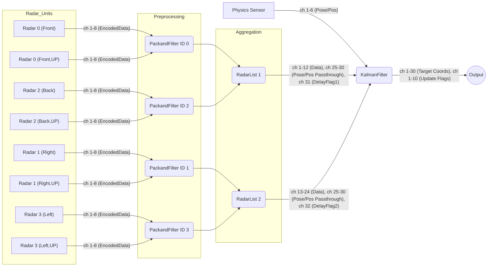

# 防空レーダーシステム仕様概要 (更新版 v4.1)

## 1. システム目標

搭載された車両や構造物に対して、周囲の空中目標（航空機など）を探知・追跡し、そのグローバル座標 (Physics Sensor 座標系) を提供することを目的とする。拡張カルマンフィルター (EKF) を用いて、ノイズを含むレーダー観測値から目標の正確な位置と速度を推定し、敵対的な目標を識別して特定の出力チャンネルで座標を出力する。

## 2. ハードウェア構成

- **レーダー:** 4 基の水平レーダー + 4 基の高仰角レーダーコンポーネントを使用。
  - 各レーダーは、方位角 (水平) FOV を狭く、仰角 (高仰角) FOV を広く設定。
  - 4 基の水平レーダーを垂直に積み重ね、**前向き (ID 0, 頂点)**、**右向き (ID 1)**、**後ろ向き (ID 2)**、**左向き (ID 3, 最下部)** に 90 度ずつ回転させて設置。
  - 水平レーダーは、初期設定で**Pitch Angle 0.06 (上向きオフセット 21.6°)**、**FOV X 0.04 (14.4°)**、**FOV Y 0.13 (46.8°)** に設定されている。
  - 高仰角レーダーは、水平レーダーからみて正面に、90 度傾けて仰向けにした状態で設置 (ローカル X 軸を+90° 回転させた形)。
  - 高仰角レーダーは、初期設定で**Pitch Angle -0.07 (下向きオフセット 25.2°)**、**FOV X 0.04 (14.4°)**、**FOV Y 0.13 (46.8°)** に設定されている。
  - 高仰角レーダーは、座標変換ロジックが異なる (`PackandFilterRefactorHighElevation.lua`)。
  - 各レーダーの最大探知距離 (EffectiveRange) は可変であり、探知間隔をプロパティから設定する必要がある (`PackandFilterRefactor.lua` / `PackandFilterRefactorHighElevation.lua` のプロパティ `n`)。
- **物理センサー (Physics Sensor):** 1 基。
  - 垂直に積み重ねられたレーダー群の一番下に取り付けられ、レーダー群全体と共にピボットで回転する。
  - センサーの向きは **Radar 0 と同じ方向（正面）**を向くように設置する。
  - 車両のグローバル座標 (X:東, Y:上, Z:北) および姿勢 (オイラー角 Pitch, Yaw, Roll) を取得する。
  - このセンサーの位置が、システム全体の**座標計算の基準点**となる。
- **マイクロコントローラー:** 以下の Lua スクリプトを実行するマイクロコントローラー群で構成される。
  - `PackandFilterRefactor.lua` x 4 基 (各水平レーダーに対応、`RADAR_ID` を 0, 1, 2, 3 に設定)。
  - `PackandFilterRefactorHighElevation.lua` x 4 基 (各高仰角レーダーに対応、`RADAR_ID` を 0, 1, 2, 3 に設定)。
  - `RadarListRefactorv2.lua` x 2 基 (RadarList1 は ID 0, 2 を担当、RadarList2 は ID 1, 3 を担当)。
  - `KalmanFilterRefactor.lua` x 1 基 (システム全体の処理を担当)。

## 3. マイクロコントローラーアーキテクチャとデータフロー

**(注:** Physics Sensor からの情報は、現在 `KalmanFilterRefactor.lua` マイコンでのみ座標変換と EKF 計算のために使用されています。)

## 4. 各処理ステップ詳細

### 4.1. レーダー出力

- 各レーダーは、探知した目標（最大 8 目標）の情報をローカル極座標（距離、方位角、仰角）と探知経過時間 tick でコンポジット信号として出力する。
- 探知からの経過時間 (数値 ch4) は、レーダー内部の「真の値」が更新された瞬間に 0 となる。
- レーダーの探知間隔 (DetectionInterval) は、EffectiveRange および `PackandFilterRefactor.lua` / `PackandFilterRefactorHighElevation.lua` のプロパティ `n` 設定に依存する。

### 4.2. `PackandFilterRefactor.lua` / `PackandFilterRefactorHighElevation.lua`

- **役割:** 各レーダーからの入力を受け、フィルタリングとデータ圧縮を行う。
- **フィルター:**
  - レーダーの探知更新タイミング (入力 ch4 が 0 になった時) を基準とする。
  - プロパティ `n` で指定された**探知間隔の期間**における、各検出目標の距離・方位角・仰角の **最大値** と **最小値** を記録する (`targetMaxData`, `targetMinData`)。
  - 探知更新タイミング (経過 tick が 0 になった時) に、前の期間に記録した最大値と最小値から **範囲中間値 (max + min) / 2** を計算する。
- **データ圧縮 (`packTargetData` 関数):**
  - 計算された中間値（距離、方位角、仰角）を 2 つの **7 桁** の数値 `pack1`, `pack2` に圧縮する。
  - **エンコード方式:**
    - **距離:** 整数に四捨五入後 (`math.floor(distance + 0.5)`)、上限 9999m でキャップし、ゼロ埋め 4 桁の文字列 (`string.format("%04d", intDistance)`) に変換。前半 2 桁を `pack1` の末尾 2 桁に、後半 2 桁を `pack2` の末尾 2 桁に格納。
    - **方位角/仰角:**
      - **符号:** `getSignCode` 関数で `'1'` (負) または `'2'` (正/ゼロ) の文字列を取得。
      - **絶対値:** `math.abs(angle) + 0.00005` で微小値を加算後、`string.format("%f", ...)` で文字列化し、小数点以下 4 桁を抽出 (`string.sub(..., dotPos + 1, dotPos + 4)`)。4 桁に満たない場合はゼロ埋め。
      - **pack1:** `aziSignCode(1桁) + aziFractionStr(4桁) + distPart1(2桁)` を数値化。
      - **pack2:** `eleSignCode(1桁) + eleFractionStr(4桁) + distPart2(2桁)` を数値化。
  - **レーダー ID エンコード:**
    - スクリプト冒頭で設定された `RADAR_ID` (0-3) に基づき、`pack1`, `pack2` の **符号** を決定して出力する。
      - ID 0 (Front): (-, -)
      - ID 1 (Right): (-, +)
      - ID 2 (Back): (+, -)
      - ID 3 (Left): (+, +)
- **出力:** 圧縮された `pack1`, `pack2` のペアを最大 **4 目標分** (**8 チャンネル**) 出力する。プロパティ `Min Dist` 以下の距離の目標は出力しない。
- **高仰角版 (`PackandFilterRefactorHighElevation.lua`):**
  - 物理的に上向き設置されたレーダーからの入力を想定。
  - 入力されたローカル極座標を、**水平設置レーダー基準のローカル極座標に変換**してからフィルタリングと圧縮を行う。
  - 変換には `FRONT_OFFSET` と `HEIGHT_OFFSET` 定数を使用する。

### 4.3. `RadarListRefactorv2.lua`

- **役割:** 2 つの `PackandFilterRefactor` (水平・高仰角含む) からのデータ (それぞれ最大 8 目標) を集約し、`KalmanFilterRefactor` へ渡すデータを整理する。RadarList1 (ID 0, 2 担当) と RadarList2 (ID 1, 3 担当) の 2 基が独立して動作する。
- **入力:**
  - 数値 1-16: `PackandFilter` A (ID 0 または 1) からの出力 (pack1, pack2 x 8 目標)
  - 数値 17-32: `PackandFilter` C (ID 2 または 3) からの出力 (pack1, pack2 x 8 目標)
  - (物理センサーデータ ch 25-30 はこのスクリプトでは直接使用されないが、配線は通過する可能性がある)
- **データ集約:** 2 系統からの入力データを結合する (`allTargets` リスト)。
- **オーバーフロー処理:**
  - 入力された合計目標数が自身の出力上限 (**6 目標**) を超えた場合、その Tick では 6 目標分のみを `targetsToOutput` リストに入れる。
  - 出力しきれなかったデータ (`allTargets` の残り) は内部の `overflowBuffer` に一時保存する。
- **遅延出力とフラグ:**
  - `overflowBuffer` にデータが保存された場合、**次の Tick** で `isOutputtingOverflow` フラグが `true` になり、バッファ内のデータが `targetsToOutput` として出力される。
  - 遅延データを出力する Tick では、出力チャンネル **31** (RadarList1) または **32** (RadarList2) に **1** (遅延フラグ) をセットする。
  - 通常データを出力する Tick では、遅延フラグチャンネルに **0** がセットされる。
- **物理センサーデータパススルー:** (このスクリプトでは直接のパススルーロジックは記述されていないが、Kalman Filter への入力のために配線上で接続される)
- **出力:** 整理された `pack1`, `pack2` のペア (最大 6 目標分、チャンネル 1-12)、遅延フラグ (チャンネル 31 または 32) を出力する。

### 4.4. `KalmanFilterRefactor.lua`

- **役割:** システムの中核。目標情報の展開、座標変換、EKF による追跡、データアソシエーション、目標管理、敵対判定、最終的な座標出力を行う。
- **入力:**
  - 数値 1-12: RadarList1 からの出力 (`pack1`, `pack2` x 6 目標)
  - 数値 13-24: RadarList2 からの出力 (`pack1`, `pack2` x 6 目標)
  - 数値 25-30: 物理センサーデータ (X, Y, Z, Pitch, Yaw, Roll) - RadarList 経由または直接接続
  - 数値 31: RadarList1 からの遅延フラグ (`isDelayed1`)
  - 数値 32: RadarList2 からの遅延フラグ (`isDelayed2`)
- **データ展開 (`unpackTargetData` 関数):**
  - 入力された `pack1`, `pack2` をデコードし、距離(m)、ローカル方位角(rad)、ローカル仰角(rad)、レーダー ID(0-3) を復元する。
  - `PackandFilterRefactor.lua` の `packTargetData` 関数に対応した 7 桁数値の構造を解析する。
- **座標変換 (`localToGlobalCoords` 関数):**
  - レーダー基準のローカル極座標（入力）をローカル直交座標 (`locX`, `locY`, `locZ`) に変換。
  - `radarId` に基づき **ヨー回転** を行い、車両前方基準のローカル座標に変換 (`vehLocVec_rotated`)。
    - ID 0: 回転なし
    - ID 1: +90 度 ($PI/2$) 回転
    - ID 2: +180 度 ($PI$) 回転
    - ID 3: -90 度 ($-PI/2$) 回転
  - レーダー設置位置の Y 軸オフセット $2.5 / (rId + 1)$ を追加。
  - 車両の姿勢 (`pitch`, `yaw`, `roll`) に基づき **クォータニオン回転** (`eulerZYX_to_quaternion`, `rotateVectorByQuaternion`) を適用し、グローバルな**相対ベクトル**を得る (`globalRelativeVector`)。オイラー角の回転順序は ZYX (Roll, Yaw, Pitch)。
  - 物理センサーのグローバル座標 (`physicsSensorData.x`, `.y`, `.z`) を加算し、最終的な目標のグローバル座標 (Physics Sensor 座標系: X=東, Y=上, Z=北) を得る (`gX`, `gY`, `gZ`)。
- **EKF (`extendedKalmanFilterUpdate` 関数):**
  - **状態ベクトル X:** $[x, v_x, y, v_y, z, v_z]^T$ (グローバル位置・速度、計 6 状態)。
  - **予測ステップ:**
    - 状態遷移行列 $F$ を作成 (等速直線運動モデル)。
    - 状態 $X$ を予測: $X_{predicted} = F \times X_{current}$。
    - **プロセスノイズ共分散行列 Q** を計算:
      - 基本となる $Q_{base}$ を $dt$ (時間差) から計算。
      - 適応的係数 `adaptiveFactor` を、前回の誤差 $\epsilon_{last}$ とプロパティ (`P_BASE`, `P_ADPT`, `P_NOISE_EPS_THRS`, `P_NOISE_EPS_SLOPE`) を用いて計算。
      - $Q_{adapted} = adaptiveFactor \times Q_{base}$。
    - 誤差共分散 $P$ を予測: $P_{predicted} = uncertaintyFactor \times (F \times P_{current} \times F^T) + Q_{adapted}$。
    - `uncertaintyIncreaseFactor` は プロパティ `PRED_UNCERTAINTY_FACT` を用いて $PRED\_UNCERTAINTY\_FACT ^ {(2 \times dt\_ticks)}$ で計算。
  - **更新ステップ:**
    - 観測値 $Z$ (`distance`, `globalElevation`, `globalAzimuth`) を用意。
    - 観測ヤコビ行列 $H$ と観測予測値 $h$ を `getObservationJacobianAndPrediction` 関数で計算。
    - **観測ノイズ共分散行列 R** を計算: テンプレート `OBSERVATION_NOISE_MATRIX_TEMPLATE` を基に、距離の分散 $R[1][1]$ を $distance^2$ でスケール。
    - イノベーション (観測残差) $Y$ を計算: $Y = Z - h$。角度差は `CalculateAngleDifference` (atan2 相当) を使用して正規化。
    - カルマンゲイン $K$ を計算: $K = P_{predicted} \times H^T \times S^{-1}$ ここで $S = H \times P_{predicted} \times H^T + R$。
    - 状態 $X$ を更新: $X_{updated} = X_{predicted} + K \times Y$。
    - 共分散 $P$ を更新: $P_{updated} = (I - K \times H) \times P_{predicted} \times (I - K \times H)^T + K \times R \times K^T$ (Joseph form)。
    - 誤差指標 $\epsilon$ を計算: $\epsilon = Y^T \times S^{-1} \times Y$。
  - **`dt` (時間差) 計算:**
    - `kalmanfilter.lua` 内部の `currentTick` カウンターを使用。
    - 各観測データについて、入力された遅延フラグ (`isDelayed1` or `isDelayed2`) を確認。
    - 観測データの真の発生 Tick を推定: `observationTick = isDelayed and (currentTick - 1) or currentTick`。
    - EKF で使用する時間差 (秒) を計算: `dt_ticks = observation.obsTick - currentTarget.lastTick` (前回更新 Tick からの差)、`dt_sec = dt_ticks / 60.0`。
- **データアソシエーション:**
  - 既存の各追跡目標 (`targetList`) に対して、全ての新規観測データ (`currentObservations`) で EKF 更新を **試算**。
  - 更新時の誤差指標 $\epsilon$ が最小で、かつプロパティ `D_ASOC` 以下の観測データを、その目標に対応するものとして割り当てる (**最近傍法**)。
- **目標管理:**
  - **新規登録:** どの既存目標にも割り当てられなかった観測データを新規目標として登録。
    - 内部 ID (`internalId`) を付与。出力 ID (`outputId`) は `nil` で初期化。
    - 初期状態: 位置は観測時のグローバル座標、速度はゼロ。
    - 初期誤差共分散 `P_init` は、位置の分散を観測ノイズから、速度の分散を `INITIAL_VELOCITY_VARIANCE` から設定。
  - **削除:**
    - 一定時間 (プロパティ `T_OUT`) 更新されなかった目標。
    - または、自機から離反している (接近速度 `closingSpeed` < プロパティ `TGT_LVING`) と判定された目標をリストから削除。
    - 削除時に割り当てられていた `outputId` を解放 (`releaseOutputId`)。
- **敵対判定 (`checkHostileCondition`, `calculateClosingSpeed`):**
  - 目標ごとに `identification_count` (EKF 更新成功回数) と `recent_closing_speeds` (直近の接近速度リスト) を記録。
  - 接近速度は `calculateClosingSpeed` 関数で、相対位置ベクトルと目標速度ベクトルの内積から計算。
  - `identification_count` が プロパティ `IDENTI_THRS` 以上、**かつ**、直近 プロパティ `TGT_RECENT_UPDATE` 回の `closingSpeed` がすべて プロパティ `TGT_CLOSING_SPD` を超えている場合に、`target.is_hostile` フラグを `true` に設定。
- **出力 ID 管理 (`assignOutputId`, `releaseOutputId`):**
  - `target.is_hostile` が `true` になった目標に対して、空いている出力 ID (1 ～ `MAX_TRACKED_TARGETS` (デフォルト 10)) を割り当てる (`assignOutputId`)。
  - `target.is_hostile` が `false` になった、または目標が削除される場合に、割り当てられていた出力 ID を解放する (`releaseOutputId`)。
- **出力:**
  - **Output ID が割り当てられている** 追跡中の各目標について、現在の `currentTick` における **予測位置** (X, Y, Z) を計算 (`target.X[1][1] + target.X[2][1] * dt_pred_sec`, etc.)。
  - 対応する **Output ID に基づく固定チャンネル** に座標を出力。
    - 目標 Output ID $i$ の座標はチャンネル $(i-1) \times 3 + 1$ (X), $(i-1) \times 3 + 2$ (Y), $(i-1) \times 3 + 3$ (Z) に出力。
  - 出力は最大 `MAX_TRACKED_TARGETS` (デフォルト 10) 目標まで。
  - オンオフ出力チャンネル 1 ～ `MAX_TRACKED_TARGETS` に、対応する Output ID の目標が **その Tick で更新されたかどうか** を示すフラグ (`target.isUpdated`) を出力。

## 5. 座標系

- **レーダーローカル:** 各レーダーの正面方向を基準とする極座標および直交座標。
- **車両ローカル:** 車両の前方を基準とする直交座標 (+X:右, +Y:上, +Z:前)。`localToGlobalCoords` 内で一時的に使用。
- **グローバル:** Stormworks の **Physics Sensor 座標系** (**左手系**: +X:東, +Y:上, +Z:北) を基準とする。最終出力はこの座標系。

## 6. 主要パラメータ・設定項目

- **`PackandFilterRefactor.lua`:**
  - `RADAR_ID`: 0, 1, 2, 3 のいずれかを手動設定。
  - プロパティ `n`: フィルター期間 (tick)。
  - プロパティ `Min Dist`: 最小探知距離 (m)。
- **`PackandFilterRefactorHighElevation.lua`:**
  - 上記に加え、`FRONT_OFFSET`, `HEIGHT_OFFSET` 定数。
- **`RadarListRefactorv2.lua`:**
  - `MAX_INPUT_TARGETS_PER_SOURCE`: 各入力ソースからの最大目標数 (8)。
  - `MAX_OUTPUT_TARGETS`: 出力する最大目標数 (6)。
- **`KalmanFilterRefactor.lua`:**
  - (コード内定数) `MAX_TRACKED_TARGETS`: 最大追跡・出力目標数 (デフォルト 10)。
  - プロパティ `D_ASOC`: データアソシエーション閾値 ($\epsilon$)。
  - プロパティ `T_OUT`: 目標タイムアウト tick 数。
  - プロパティ `TGT_LVING`: 目標離反判定の接近速度閾値 (m/s)。
  - (コード内定数) `INITIAL_VELOCITY_VARIANCE`: 新規目標の初期速度分散 ($m^2/s^2$)。
  - (コード内定数) `OBSERVATION_NOISE_MATRIX_TEMPLATE`: 観測ノイズの基本設定 (R0 係数含む)。
  - プロパティ `P_BASE`: プロセスノイズの基本係数。
  - プロパティ `P_ADPT`: プロセスノイズの適応的スケーリング係数。
  - プロパティ `P_NOISE_EPS_THRS`: プロセスノイズ適応調整の $\epsilon$ 閾値。
  - プロパティ `P_NOISE_EPS_SLOPE`: プロセスノイズ適応調整の $\epsilon$ 傾き。
  - プロパティ `PRED_UNCERTAINTY_FACT`: 予測不確かさ増加係数の底。
  - プロパティ `IDENTI_THRS`: 敵対判定に必要な同定成功回数。
  - プロパティ `TGT_CLOSING_SPD`: 敵対判定の接近速度閾値 (m/s)。
  - プロパティ `TGT_RECENT_UPDATE`: 敵対判定に必要な閾値超えの連続更新回数。

## 7. 関連システム (参考)

以下のスクリプトは、本レーダーシステムからの出力を利用する火器管制システム (FCS) の一部と考えられます。これらの仕様は本ドキュメントの範囲外ですが、連携のために存在を記載します。

- **`PackRefactor.lua` (MissileFCS):**
  - `KalmanFilterRefactor.lua` から出力される敵対目標座標 (Output ID ベース) を入力。
  - 共有バスを通じて他の FCS と連携し、担当目標を選択・ロックオン。
  - 発射トリガーとミサイル信号強度を監視し、発射信号とデータリンク座標を出力。担当目標管理は Output ID ベース。
- **`VLSFCS.lua`:**
  - 垂直発射システム (VLS) 用の FCS。
  - `KalmanFilterRefactor.lua` の出力を受け取る。
  - ハッチ制御、発射タイミング調整、共有バスによる競合チェック (前の FCS の状態や担当重複を確認) などのロジックを含む。

## 8. 更新履歴に基づく変更点

- ハードウェア構成を水平 4 基+高仰角 4 基に修正、レーダー初期設定、探知間隔のプロパティ化を追記。
- マイクロコントローラー構成を更新 (`PackandFilterHighElevation.lua` x4, `RadarListRefactorv2.lua` x2)。
- Physics Sensor の使用箇所に関する注記を修正。
- `PackandFilterRefactor.lua` のフィルタリングロジックを、レーダーの探知更新タイミング (ch4==0) に基づく範囲中間値計算に修正。データ圧縮方式を 7 桁数値エンコード方式に更新。探知間隔 `n` のプロパティ化を反映。
- `PackandFilterRefactorHighElevation.lua` を追加。上向きレーダー用の座標変換処理を含む。
- `RadarListRefactorv2.lua` を使用するように更新。入力チャンネル仕様を修正。遅延出力機能と遅延フラグ (ch31/32) を反映。
- `KalmanFilterRefactor.lua` を大幅更新:
  - データ展開 (`unpackTargetData`) を 7 桁数値に対応。
  - 座標変換 (`localToGlobalCoords`) にクォータニオン回転を導入。レーダー設置オフセットを追加。
  - EKF の $dt$ 計算で遅延フラグを考慮。
  - EKF のプロセスノイズ $Q$ に適応的調整を導入。予測誤差共分散 $P$ の計算式を更新。
  - EKF の更新ステップで角度差の正規化を導入。誤差共分散 $P$ の更新に Joseph form を使用。
  - 敵対判定ロジック (`checkHostileCondition`, `calculateClosingSpeed`) を追加。
  - Output ID の割り当てと解放ロジック (`assignOutputId`, `releaseOutputId`) を追加。
  - 出力を Output ID ベースの固定チャンネルに変更。更新フラグ (on/off ch 1-10) を追加。
- 関連システム (`PackRefactor.lua`, `VLSFCS.lua`) の記述を更新し、Output ID ベースの連携を反映。
- 全体的にパラメータ名をプロパティ取得に変更し、設定の柔軟性を向上。

## 9. 課題

- データアソシエーションは最近傍法であり、目標が交差する場合などに誤割り当てが発生する可能性がある。
- 高仰角レーダーや VLSFCS など、特定の構成要素に関する詳細な仕様統合が必要な場合がある。
- 目標の敵判定を、こちらに向かってきているかどうかも含めて考える必要がある可能性が高い。
